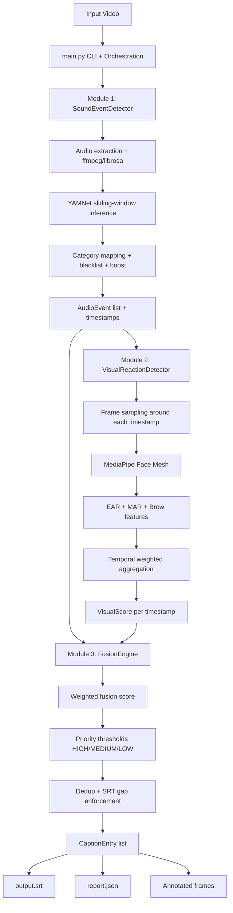

# [DMP 2026] PlanetRead - Intelligent Closed Caption Suggestion Tool

Three-module, multi-modal pipeline that generates non-speech closed captions from video.

This project detects important non-dialog sounds (for example, scream, glass break, door slam, laughter), verifies human reaction around those moments, and writes final subtitle suggestions as an SRT file.

## Why this project matters

Many subtitle pipelines focus heavily on speech but under-represent meaningful non-speech events. This can reduce accessibility and context for deaf and hard-of-hearing audiences.

This project addresses that gap by:

1. Detecting candidate sound events from audio.
2. Checking visual reaction around those timestamps.
3. Fusing both signals to decide whether a caption should be emitted.

The result is a stronger captioning signal than audio-only heuristics for many cinematic/social scenes.

## Problem it solves

Traditional approaches often produce one of two failures:

1. Too many captions: ambient or low-value sounds flood subtitles.
2. Too few captions: brief but important sound effects are missed.

This pipeline reduces both by combining category-aware audio confidence with visual reaction evidence, then applying priority-based thresholds.

## High-level architecture

1. Module 1 ([modules/sound_detector.py](modules/sound_detector.py))
2. Module 2 ([modules/visual_detector.py](modules/visual_detector.py))
3. Module 3 ([modules/fusion_engine.py](modules/fusion_engine.py))
4. Output writers ([utils/srt_writer.py](utils/srt_writer.py))
5. Pipeline orchestrator ([main.py](main.py))
6. Tunable parameters ([config.py](config.py))

## Flow diagram



## Full directory structure (workspace snapshot)

```text
Intelligent-cc-generation/
├── demo_results/
│   ├── frames/
│   │   ├── frame_00000_t0.00s_music.jpg
│   │   ├── frame_00817_t34.08s_rat_squeak.jpg
│   │   ├── frame_00851_t35.52s_door.jpg
│   │   ├──(...remaining annotated frames of video)
│   ├── final_results.json
│   ├── output.srt
│   ├── pipeline.log
│   └── report.json
├── modules/
│   ├── fusion_engine.py
│   ├── sound_detector.py
│   └── visual_detector.py
├── utils/
│   ├── __init__.py
│   ├── logger.py
│   └── srt_writer.py
├── config.py
├── fight.mp4
├── main.py
├── README.md
└── requirements.txt
```

## End-to-end pipeline (actual implementation)

1. `main.py` parses CLI args (`--video`, `--output`, `--no-visual`, `--debug`, `--no-frames`).
2. Module 1 extracts mono 16 kHz audio and runs YAMNet in sliding windows.
3. Module 1 maps YAMNet classes to project categories, applies boost factors, filters blacklist classes, merges close duplicates, and caps per-category events.
4. Module 2 receives Module 1 timestamps and samples frames in a local temporal window around each event.
5. Module 2 computes face-based reaction features (EAR, MAR, brow raise), normalizes and aggregates into per-event visual scores.
6. Module 3 computes fused scores using weighted audio + visual signals and priority-dependent thresholds.
7. Module 3 de-duplicates temporally similar accepted captions and enforces SRT timeline gaps.
8. Writers generate:
9. `output.srt`
10. `report.json`
11. Optional annotated reaction frames in `demo_results/frames/`.

## Deep scan of the 3 modules

### Module 1: Sound Event Detection

Source: [modules/sound_detector.py](modules/sound_detector.py)

Core logic:

1. Extract audio from video with ffmpeg + soundfile (fallback to librosa).
2. Resample/standardize to 16 kHz mono.
3. Sliding-window inference:
4. Window: `0.96s` (`AUDIO_WINDOW_SEC`)
5. Hop: `0.48s` (`AUDIO_HOP_SEC`)
6. Run YAMNet and keep top classes above `YAMNET_RAW_THRESHOLD`.
7. Discard known noisy classes via `YAMNET_BLACKLIST`.
8. Map class tokens to `SOUND_CATEGORIES` entries.
9. Apply category boost and `AUDIO_EMIT_THRESHOLD`.
10. Merge near events (`EVENT_MERGE_GAP_SEC`) and cap category floods (`MAX_EVENTS_PER_CATEGORY`).

Output: list of `AudioEvent` dataclasses with timestamp, category, display label, priority, confidence, and raw class evidence.

Why this design helps:

1. Better capture of short events than one-shot full-clip inference.
2. More controllable false-positive behavior through category map, blacklist, and thresholds.

### Module 2: Visual Reaction Detection

Source: [modules/visual_detector.py](modules/visual_detector.py)

Core logic:

1. For each audio timestamp, open a temporal window:
2. Start: `t - VISUAL_WINDOW_BEFORE_SEC`
3. End: `t + VISUAL_WINDOW_AFTER_SEC`
4. Uniformly sample up to `VISUAL_MAX_FRAMES_PER_WINDOW` frames.
5. Use MediaPipe Face Mesh per frame.
6. Compute facial reaction primitives:
7. EAR (eye opening)
8. MAR (mouth opening)
9. Brow raise
10. Normalize with baselines from config and clamp to `[0, 1]`.
11. Compute per-frame composite score from weighted sub-scores.
12. Aggregate with temporal weighting (frames near the event are weighted more).
13. Return `VisualScore` with `reaction_score`, valid frame count, confidence tier, and note.

Output: `Dict[timestamp, VisualScore]`.

Why this design helps:

1. Reactions are time-distributed, not single-frame; temporal aggregation is more robust.
2. Better resilience against isolated bad frames or brief face-tracking misses.

### Module 3: Fusion Decision Engine

Source: [modules/fusion_engine.py](modules/fusion_engine.py)

Core logic:

1. For each audio event, locate matching visual score (with float tolerance fallback).
2. Compute fusion score:

`fusion = FUSION_AUDIO_WEIGHT * audio_conf + FUSION_VISUAL_WEIGHT * visual_reaction`

3. Apply priority threshold (`FUSION_THRESHOLD`):
4. `HIGH`: lenient
5. `MEDIUM`: moderate
6. `LOW`: strict
7. If no faces are detected globally, switch to audio-only mode and reduce thresholds by 20%.
8. Accept/reject each candidate based on score vs threshold.
9. De-duplicate same-category events within `CAPTION_DEDUP_SEC`.
10. Build caption entries with priority-informed durations.
11. Enforce non-overlap and minimum subtitle gap (`SRT_MIN_GAP_SEC`).
12. Optionally annotate frames for accepted captions.

Output: list of final `CaptionEntry` objects for SRT/JSON reporting.

Why this design helps:

1. Keeps critical sounds sensitive while suppressing low-value noise.
2. De-duplication and gap handling make subtitle output more readable.

## Features

1. Three-stage audio-visual fusion architecture.
2. Priority-aware emission logic.
3. Audio-only fallback when faces are absent or visual step is skipped.
4. Config-driven thresholds and category mapping.
5. Structured machine-readable report output (`report.json`).
6. Optional visual debugging via frame annotation.
7. CLI flags for quick experimentation and debugging.

## Tech stack

1. Python 3.x
2. TensorFlow 2.15 + TensorFlow Hub (YAMNet)
3. MediaPipe Face Mesh
4. OpenCV
5. NumPy
6. ffmpeg (system or `imageio-ffmpeg` fallback path used by code)
7. soundfile / librosa for audio handling

Dependencies tracked in [requirements.txt](requirements.txt).

## Project structure (important files)

1. [main.py](main.py): CLI and orchestration of all modules.
2. [config.py](config.py): all thresholds, windows, weights, categories, and output defaults.
3. [modules/sound_detector.py](modules/sound_detector.py): Module 1.
4. [modules/visual_detector.py](modules/visual_detector.py): Module 2.
5. [modules/fusion_engine.py](modules/fusion_engine.py): Module 3.
6. [utils/srt_writer.py](utils/srt_writer.py): SRT + JSON writers.
7. [demo_results/](demo_results/): generated outputs.

## Setup

### 1. Create and activate virtual environment

Windows PowerShell:

```powershell
python -m venv .venv
.\.venv\Scripts\Activate.ps1
```

### 2. Install dependencies

```powershell
pip install -r requirements.txt
```

### 3. Ensure ffmpeg is available

The code first checks system ffmpeg. If unavailable, it attempts to use `imageio-ffmpeg` as a fallback.

## How to run

### Default run

```powershell
python main.py
```

Uses default video path from [main.py](main.py) and default output directory from [config.py](config.py).

### Run on a specific video

```powershell
python main.py --video path\to\clip.mp4
```

### Audio-only mode (skip Module 2)

```powershell
python main.py --video path\to\clip.mp4 --no-visual
```

### Custom output directory

```powershell
python main.py --video path\to\clip.mp4 --output demo_results
```

### Debug logs and no frame dumps

```powershell
python main.py --video path\to\clip.mp4 --debug --no-frames
```

## Output artifacts

1. `demo_results/output.srt`: final subtitle suggestions.
2. `demo_results/report.json`: full report with metadata, audio events, visual scores, and final captions.
3. `demo_results/frames/*.jpg`: optional annotated frames.
4. `demo_results/pipeline.log` (if enabled by logger setup): processing details.

## Key configuration knobs

All in [config.py](config.py):

1. Audio sensitivity:
2. `YAMNET_RAW_THRESHOLD`
3. `AUDIO_EMIT_THRESHOLD`
4. `EVENT_MERGE_GAP_SEC`
5. Visual analysis window:
6. `VISUAL_WINDOW_BEFORE_SEC`
7. `VISUAL_WINDOW_AFTER_SEC`
8. `VISUAL_MAX_FRAMES_PER_WINDOW`
9. Fusion behavior:
10. `FUSION_AUDIO_WEIGHT`
11. `FUSION_VISUAL_WEIGHT`
12. `FUSION_THRESHOLD`
13. Subtitle timeline:
14. `SRT_DISPLAY_DURATION`
15. `SRT_MIN_GAP_SEC`

## Advantages

1. Multi-modal decisioning improves over simple audio-only triggers.
2. Priority-aware thresholds preserve critical event recall.
3. Config-first design makes tuning easy without changing code.
4. Explainable behavior with intermediate artifacts and logs.
5. Graceful fallbacks (visual skip/error handling and audio-only mode).

## Limitations

1. YAMNet class biases may affect niche/regional sound coverage.
2. Visual detection depends on clear, detectable faces; occlusion/low light hurts performance.
3. Heuristic facial scoring (EAR/MAR/brow) is lightweight but not emotion-model level.
4. Fixed thresholds can require per-domain tuning.
5. Real-time/long-duration optimization is limited; current flow is clip-oriented.
6. No built-in benchmark harness in this repository for precision/recall/F1 tracking.

## Future work

1. Add stronger audio backbones (for example, PANNs/BEATs or fine-tuned models).
2. Add broader visual cues (pose/body motion) beyond face-only reactions.
3. Introduce adaptive thresholds by scene context and sound type.
4. Build quantitative evaluation suite with labeled datasets.
5. Add batch processing and lightweight service API/GUI.
6. Expand language/domain tuning for local/regional content.
7. Add confidence calibration and uncertainty reporting in outputs.

## Practical use cases

1. Accessibility-first subtitle assistance for edited video content.
2. Pre-captioning support for post-production teams.
3. Assistive indexing of high-salience non-speech events.
4. Educational demos of multi-modal event fusion.

## Troubleshooting

1. No captions generated:
2. Lower `AUDIO_EMIT_THRESHOLD` and/or `FUSION_THRESHOLD` in [config.py](config.py).
3. Verify input has audible non-speech events.
4. Visual scores all low or missing:
5. Try `--no-visual` to verify audio path independently.
6. Check lighting/face visibility in source video.
7. Audio extraction fails:
8. Ensure ffmpeg is installed or fallback dependencies are available.

## Current status

This repository already includes the complete 3-module flow (audio detection, visual reaction scoring, and fusion-based final caption emission) executed by [main.py](main.py).
