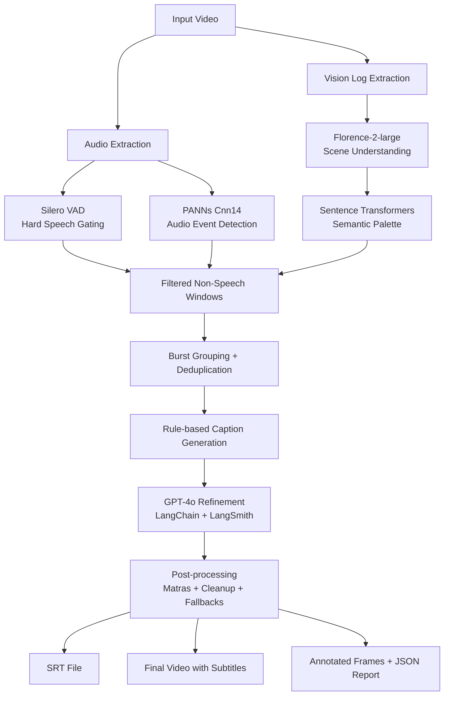

# Intelligent Closed Caption Suggestion Tool

**PlanetRead – C4GT 2026 DMP**  
**Contributor:** Aditi Prabakaran

---

## Overview

This project generates **high-quality Hindi closed captions** for non-speech audio events in Indian video content such as TV dramas, educational videos, and documentaries.

Traditional subtitle systems primarily focus on speech transcription. This pipeline is designed specifically for **non-dialog audio events**, including:

- Music and traditional instruments (tabla, sitar, dhol, shehnai)
- Laughter
- Bird calls and environmental sounds
- Footsteps, rustling, wind, and other ambient sounds

The system produces clean, professional Hindi captions in the format **`[caption text]`** and burns them directly onto the final video using the **Tiro Devanagari** font.

---

## Current Progress (July 2026)

| Component | Status | Notes |
|-----------|--------|-------|
| Music + Instrument Detection | Strong | Correctly detects tabla, sitar, dhol with natural phrasing |
| Laughter Detection | Working | Outputs "हल्की हँसी सुनाई दे रही है" |
| Bird & Environmental Sounds | Good | Natural and varied captions |
| Animal Hallucination Control | Significantly Improved | Duck, rodents, and generic animal labels largely suppressed |
| Hindi Matras & Formatting | Stable | Correct Devanagari, square brackets, no punctuation |
| Speech Overlap Prevention | Strong | Hard gating using Silero VAD |
| Video Rendering | Complete | Tiro Devanagari with clean subtitle overlay |
| Observability | Integrated | LangSmith for token usage and cost tracking |

### Latest Result (Bharat Ek Khoj – Episode 016)

- Generated **90 high-quality caption segments**
- Strong performance on music, instruments, birds, and laughter
- Major reduction in false animal captions compared to earlier versions

---

## Architecture

```mermaid
flowchart TD
    A[Input Video] --> B[Audio Extraction]
    A --> C[Vision Log Extraction]

    B --> D[Silero VAD<br/>Hard Speech Gating]
    B --> E[PANNs Cnn14<br/>Audio Event Detection]

    C --> F[Florence-2-large<br/>Scene Understanding]
    F --> G[Sentence Transformers<br/>Semantic Palette]

    D --> H[Filtered Non-Speech Windows]
    E --> H
    G --> H

    H --> I[Burst Grouping + Deduplication]
    I --> J[Rule-based Caption Generation]
    J --> K[GPT-4o Refinement<br/>LangChain + LangSmith]
    K --> L[Post-processing<br/>Matras + Cleanup + Fallbacks]

    L --> M[SRT File]
    L --> N[Final Video with Subtitles]
    L --> O[Annotated Frames + JSON Report]
```

---

## Key Components

| Stage | Technology | Role |
|-------|------------|------|
| Audio Event Detection | PANNs (Cnn14) | Detects non-speech sounds with per-class thresholds |
| Speech Gating | Silero VAD | Hard exclusion of speech segments |
| Scene Understanding | Florence-2-large | Generates detailed scene captions |
| Semantic Boosting | Sentence Transformers | Creates scene-aware sound palette |
| Caption Generation | Rule-based + GPT-4o | Produces natural, short Hindi captions |
| Tracking | LangSmith | Token usage and cost monitoring |
| Rendering | OpenCV + PIL + Tiro Devanagari | Professional subtitle overlay |

---

## Pipeline Flow

1. Extract audio and generate a vision log using Florence-2.
2. Run Silero VAD to create a hard speech mask.
3. Run PANNs on non-speech windows with class-specific thresholds.
4. Apply scene-aware semantic boosting.
5. Group nearby events into bursts.
6. Generate captions using deterministic rules followed by GPT-4o refinement.
7. Apply post-processing (matra fixes, animal filtering, and varied fallbacks).
8. Export the SRT file and render the final video with burned-in captions.

---

## Key Improvements Made

- Strict filtering of weak animal labels (duck, rodents, generic "animal")
- Explicit rules for correct Hindi matras (especially **घंटी** and **कौआ**)
- Varied natural ambient fallbacks instead of repetitive **"पर्यावरण की आवाज़"**
- Consistent music and instrument phrasing
- Full LangSmith integration for observability
- Professional video rendering using the Tiro Devanagari font

---

## Output Artifacts

- `captions.srt` — Final Hindi subtitle file
- `final_output.mp4` — Video with burned-in captions
- `results.json` — Full timeline and metadata
- `annotated_frames/` — Sample captioned frames
---

## Tech Stack

### Audio
- PANNs (Cnn14)
- Silero VAD
- torchaudio
- soundfile

### Vision
- Florence-2-large
- OpenCV
- Pillow (PIL)

### Language
- GPT-4o
- LangChain
- LangSmith

### Utilities
- Sentence Transformers
- NumPy
- FFmpeg

### Rendering
- OpenCV
- Pillow (PIL)
- Tiro Devanagari Font
